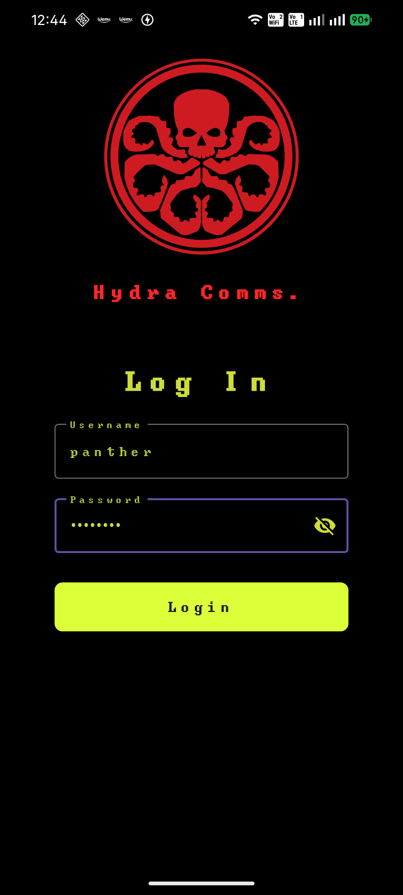
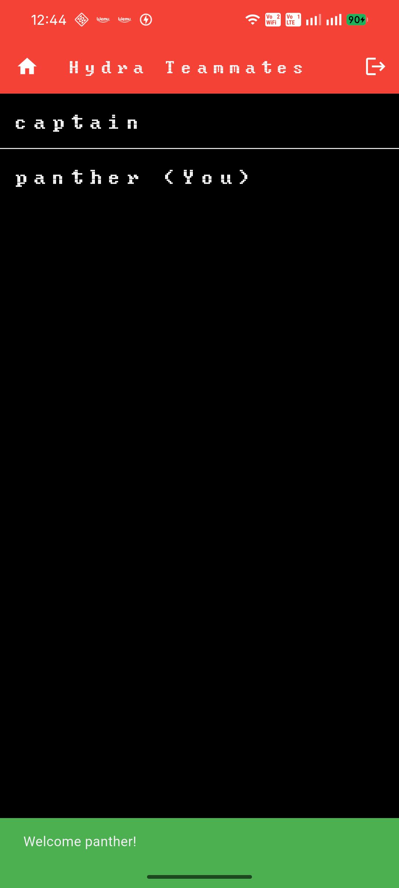
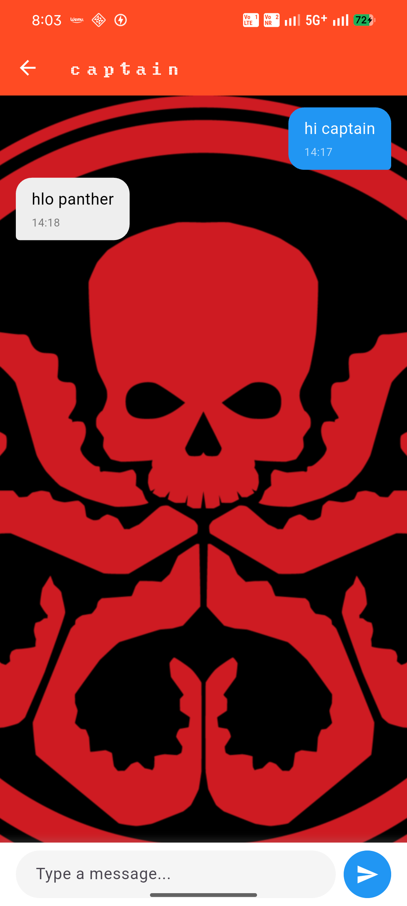

# Hydra Comms. - A chat app that hails Hydra

This is a simple real time- messaging chat app that allows hydra clan to text each other. I have made this project just to learn flutter BLoC state management code flow.

## Tech Stack

**Programming Languages -** Dart, JavaScript, SQL
**Frameworks -** Node.js, Express.js
**Tools -** Socket.IO, PostgreSQL, REST APIs

## Screenshots

  
  
  

##  App Demo

